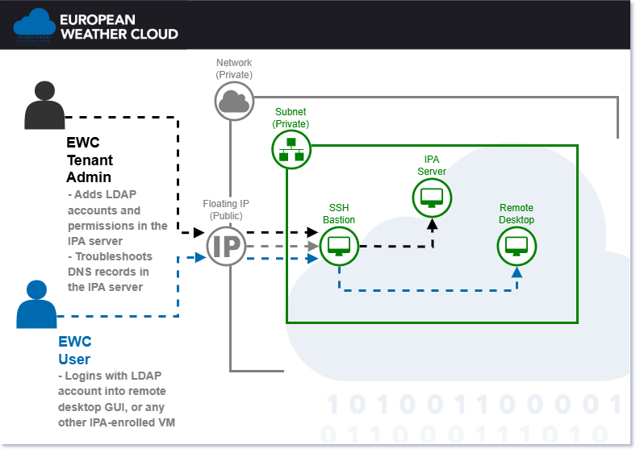

# Default Stack Provisioning
>✅ This template can be safely applied from any local work environment, even running outside an EWC tenancy's private network.

The default stack provides an integrated environment for secure access and centralized management in the [European Weather Cloud (EWC)](https://europeanweather.cloud/). It orchestrates the deployment of an IPA server for LDAP and DNS functionality, an SSH bastion for access from the public internet, and a remote desktop for graphical interfacing, while ensuring both the bastion and desktop are enrolled as clients to the IPA server to centralize authentication, authorization, and resource discovery.

This configuration template (i.e., an [Ansible Playbook](https://docs.ansible.com/ansible/latest/playbook_guide/playbooks.html)) builds upon the individual templates for [IPA server](https://europeanweather.cloud/community-hub/ipa-server-provisioning), [SSH bastion](https://europeanweather.cloud/community-hub/ssh-bastion-provisioning), [remote desktop](https://europeanweather.cloud/community-hub/remote-desktop-provisioning), and [IPA client](https://europeanweather.cloud/community-hub/ipa-client-enroll-flavour) to automate their deployment and integration.



## Functionality
The template is designed to:

* Provision the IPA server instance via Terraform, including network validation and automatic subnet DNS updates to enable centralized user management and resource discovery across the environment.
* Provision the SSH bastion instance via Terraform, configured as a secure entrypoint with intrusion prevention.
* Enroll the newly provisioned SSH bastion as an IPA client, connecting it to the IPA server for centralized credentials and DNS resolution.
* Provision the remote desktop instance via Terraform, equipped for graphical access over varying bandwidths.
* Enroll the newly provisioned remote desktop as an IPA client, integrating it with the IPA server for unified access control.

Each component's provisioning follows the create-or-update logic based on the presence of its respective `terraform.tfstate` file in the user-defined directories, allowing for independent specification of VM images, flavors, and other parameters.

After successful provisioning, you can leverage Terraform's functionality to modify or delete individual components safely. Each will have its own `main.tf` definition and `terraform.tfstate` state file under the corresponding user-defined local directories.

To learn the basics about managing infrastructure with Terraform, check out the [official documentation examples](https://developer.hashicorp.com/terraform/tutorials/aws-get-started).

>⚠️ Successful execution includes provisioning the IPA server, which updates the DNS nameserver(s) in your OpenStack subnet to point exclusively to the new IPA server. This may impact existing VMs; mitigate by enrolling them as IPA clients or manually updating their DNS configurations as detailed in the IPA server template.

## Authentication

Before proceeding, if you lack OpenStack Application Credentials or do not know
how to make them available to Ansible in your development environment, make sure
to check out [this page](https://confluence.ecmwf.int/display/EWCLOUDKB/EWC+-+How+to+request+Openstack+Application+Credentials)
and [this page](https://confluence.ecmwf.int/display/EWCLOUDKB/EWC+-+OpenStack+Command-Line+client#EWCOpenStackCommandLineclient-GettingStarted)
from EWC documentation.

Additionally, in order to configure the virtual machine after provisioning, you
required a private and public SSH keypair. Checkout this
[EWC documentation page](https://confluence.ecmwf.int/display/EWCLOUDKB/EWC+-+OpenStack+Command-Line+client#EWCOpenStackCommandLineclient-ImportSSHkey)
for details on how import your public key into OpenStack.

## Prerequisites
>💡 Versions listed correspond to minimal prerequisites.

To successfully run this playbook, the following packages should be available in your work environment:

| Name | Version | License | Home URL |
|------|---------|----- |-----|
| git | 2.0 | GPLv2  | https://git-scm.com/downloads |
| python | 3.9   | PSF | https://www.python.org/downloads  |
| ansible | 2.15 |  GPLv3+ | https://pypi.org/project/ansible  |
| terraform | 0.14  | BSL   | https://developer.hashicorp.com/terraform/install |

## Usage

### 1. Download  Ansible dependencies
>💡 By default, Ansible Roles are installed under the `~/.ansible/roles` directory within your working environment.

Download the correct version of the Ansible dependencies, if you haven't done so already:

```
ansible-galaxy role install -r requirements.yml
```

### 2. Configure and apply the template

This template can used interactively or non-interactively (i.e. with one single command to configure and also execute).
Please beware that, regardless of your mode of choice, the complete execution may take several minutes, up to an hour.

#### 2.1. Interactive Mode

By running the following command, you can trigger an interactive session that
prompts you for the necessary user inputs, and then applies changes to your
target EWC environment:

```bash
ansible-playbook default-stack-proivisionig.yml
```

#### 2.2. Non-Interactive Mode
>💡 To learn more about defining variables at runtime, checkout the
[official Ansible documentation](https://docs.ansible.com/ansible/latest/playbook_guide/playbooks_variables.html).

You can also run in non-interactive mode by passing the
`--extra-vars` or `-e` flag, followed by a map of  key-value pairs; one for
each and every available input (see [inputs section](#inputs) below). For example:

```bash
ansible-playbook \
  -e '{
        "ewc_provider":"eumetsat",
        "public_keypair_name":"my-public-key-name",
        "private_keypair_path":"~/.ssh/id_rsa",
        "private_network_name":"private",
        "security_group_name":"ipa",
        "ipa_server_tf_project_path":"~/ewc/ipa-server-1",
        "ipa_server_app_name":"ipa",
        "ipa_server_instance_name":"server",
        "ipa_server_instance_index": 1,
        "ipa_server_hostname":"ipa-server-1",
        "ipa_server_flavor_name":"eo1.large",
        "ipa_server_image_name":"Rocky-8.10-20250204105303",
        "ipa_domain":"eumetsat.sandbox.ewc",
        "ipa_admin_username":"ipaadmin",
        "ipa_admin_password":"my-secret-password",
        "ipa_admin_givenname":"IPAADMIN",
        "ipa_admin_surname":"EWC",
        "ssh_bastion_tf_project_path":"~/ewc/ssh-bastion-1",
        "ssh_bastion_app_name":"ssh",
        "ssh_bastion_instance_name":"bastion",
        "ssh_bastion_instance_index": 1,
        "ssh_bastion_flavor_name":"eo1.large",
        "ssh_bastion_image_name":"Rocky-8.10-20250204105303",
        "remote_desktop_tf_project_path":"~/ewc/remote-desktop-1",
        "remote_desktop_app_name":"remote",
        "remote_desktop_instance_name":"desktop",
        "remote_desktop_instance_index": 1,
        "remote_desktop_flavor_name":"eo1.large",
        "remote_desktop_image_name":"Rocky-8.10-20250604144456",
        "remote_desktop_instance_has_fip":"yes",
        "fail2ban_whitelisted_ip_ranges":""
    }' \
    default-stack-provisioning.yml
```

## Inputs

| Name | Description | Type | Default | Required |
|------|-------------|------|---------|----------|
| ewc_provider | your target EWC provider. Must match that the provider of your OpenStack application credentials. Valid input values are `ecmwf` or `eumetsat`. | `string` | n/a | yes |
| public_keypair_name | name of public keypair (stored in OpenStack) to be copied into the instance for remote SSH access | `string` | n/a | yes |
| private_keypair_path | path to the local private keypair to use for SSH access to the instance. Example: `~/.ssh/id_rsa` | `string` | n/a | yes |
| private_network_name | private network name to attach the instance. Example: `private` | `string` | n/a | yes |
| security_group_name | security group name to apply to the instance. Example: `ipa` | `string` | n/a | yes |
| ipa_server_tf_project_path | path to terraform working directory. Example: `~/ewc/ipa-server-1` | `string` | n/a | yes |
| ipa_server_app_name | application name, used as prefix in the full instance name. Example: `ipa` | `string` | n/a | yes |
| ipa_server_instance_name| name of the instance, used in the full instance name.  Example: `server` | `string` | n/a | yes |
| ipa_server_instance_index | index or identifier for the instance, used as suffix in the full instance name. Example: `1` | `number` | n/a | yes |
| ipa_server_hostname | hostname of the IPA server. Should match the pattern "<ipa_server_app_name>-<ipa_server_instance_name>-<ipa_server_instance_index>". Required for input validation purpose. Example: `ipa-server-1` | `string` | n/a | yes |
| ipa_server_flavor_name | name the flavor to use for the instance. To learn about available options, checkout the [official EWC VM plans documentation](https://confluence.ecmwf.int/display/EWCLOUDKB/EWC+VM+plans). 💡 A VM plan with at least 4GB of RAM is recommended for successful setup and stable operation. | `string` | n/a | yes |
| ipa_server_image_name | name of the image to use for the instance. For complete information on  available options, see the [official EWC Images documentation](https://confluence.ecmwf.int/display/EWCLOUDKB/EWC+Virtual+Images+Available). ⚠️ Only RockyLinux 9.5 and RockyLinux 8.10 VM images are currently supported. This is due to constrains imposed by the required ewc-ansible-role-ipa-server Ansible Role. Example: `Rocky-8.10-20250204105303`  | `string` | n/a | yes |
| ipa_domain | domain name to be managed by the IPA server. Example: `eumetsat.sandbox.ewc` | `string` | n/a | yes |
| ipa_admin_username | username of administrator account to replace the default IPA admin | `string` | n/a | yes |
| ipa_admin_password | password of administrator account to replace the default IPA admin | `string` | n/a | yes |
| ipa_admin_givenname | given name of the administrator to replace the default IPA admin (needs not be a physical person). Example: `EWC` | `string` | n/a | yes |
| ipa_admin_surname | surname of the administrator to replace the default IPA admin (needs not to belong to a physical person). Example: `IPAADMIN` | `string` | n/a | yes |
| ssh_bastion_tf_project_path | path to terraform working directory. Example: `~/ewc/ssh-bastion-1` | `string` | n/a | yes |
| ssh_bastion_app_name | application name, used as prefix in the full instance name. Example: `ssh-bastion` | `string` | n/a | yes |
| ssh_bastion_instance_name| name of the instance, used in the full instance name.  Example: `server` | `string` | n/a | yes |
| ssh_bastion_instance_index | index or identifier for the instance, used as suffix in the full instance name. Example: `1` | `number` | n/a | yes |
| ssh_bastion_flavor_name | name the flavor to use for the instance. To learn about available options, checkout the [official EWC VM plans documentation](https://confluence.ecmwf.int/display/EWCLOUDKB/EWC+VM+plans). 💡 A VM plan with at least 4GB of RAM is recommended for successful setup and stable operation. | `string` | n/a | yes |
| ssh_bastion_image_name | name of the image to use for the instance. For complete information on  available options, see the [official EWC Images documentation](https://confluence.ecmwf.int/display/EWCLOUDKB/EWC+Virtual+Images+Available). ⚠️ Only RockyLinux 9.5 and RockyLinux 8.10 instances are currently supported due to constrains imposed by the required ewc-ansible-role-ssh-bastion Ansible Role. Example: `Rocky-8.10-20250204105303`  | `string` | n/a | yes |
| remote_desktop_tf_project_path | path to terraform working directory. Example: `~/ewc/remote-desktop-1` | `string` | n/a | yes |
| remote_desktop_app_name | application name, used as prefix in the full instance name. Example: `remote` | `string` | n/a | yes |
| remote_desktop_instance_name| name of the instance, used in the full instance name.  Example: `desktop` | `string` | n/a | yes |
| remote_desktop_instance_index | index or identifier for the instance, used as suffix in the full instance name. Example: `1` | `number` | n/a | yes |
| remote_desktop_flavor_name | name the flavor to use for the instance. To learn about available options, checkout the [official EWC VM plans documentation](https://confluence.ecmwf.int/display/EWCLOUDKB/EWC+VM+plans). 💡 A VM plan with at least 4GB of RAM is recommended for successful setup and stable operation. | `string` | n/a | yes |
| remote_desktop_image_name | name of the image to use for the instance. For complete information on  available options, see the [official EWC Images documentation](https://confluence.ecmwf.int/display/EWCLOUDKB/EWC+Virtual+Images+Available). ⚠️ Only RockyLinux 8.10 and 9.5 instances are currently supported due to constrains imposed by the required ewc-ansible-role-remote-desktop Ansible Role. Example: `Rocky-8.10-20250204105303`  | `string` | n/a | yes |
| remote_desktop_instance_has_fip | technically required to temporarily assign a floating IP to the instance to securely connect from localhost during initial configuration. 💡 The template ensures to remove the floating IP during post-provisioning | `string` | `yes` | yes |
| fail2ban_whitelisted_ip_ranges | IPv4 ranges (in CIDR format) to be whitelisted in Fail2ban configuration. When in doubt, do not set. Example: `['10.0.0.0/24','192.168.1.0/24']` | `list(string)` | n/a | no |


## Dependencies

| Name | Version | License | Home URL |
|------|---------|-------|------|
| ewc-ansible-playbook-ipa-server-provisioning | 1.3 | MIT | https://github.com/ewcloud/ewc-ansible-playbook-flavours-and-provisioning |
| ewc-ansible-playbook-ssh-bastion-provisioning | 1.3 | MIT | https://github.com/ewcloud/ewc-ansible-playbook-flavours-and-provisioning |
| ewc-ansible-playbook-remote-desktop-provisioning | 1.3 | MIT | https://github.com/ewcloud/ewc-ansible-playbook-flavours-and-provisioning |
| ewc-ansible-playbook-ipa-client-enroll-flavour | 1.3 | MIT | https://github.com/ewcloud/ewc-ansible-playbook-flavours-and-provisioning |

## Troubleshooting
Checkout the [troubleshooting documentation](../../docs/troubleshooting.md) for
information on common problems and how to troubleshoot them.
