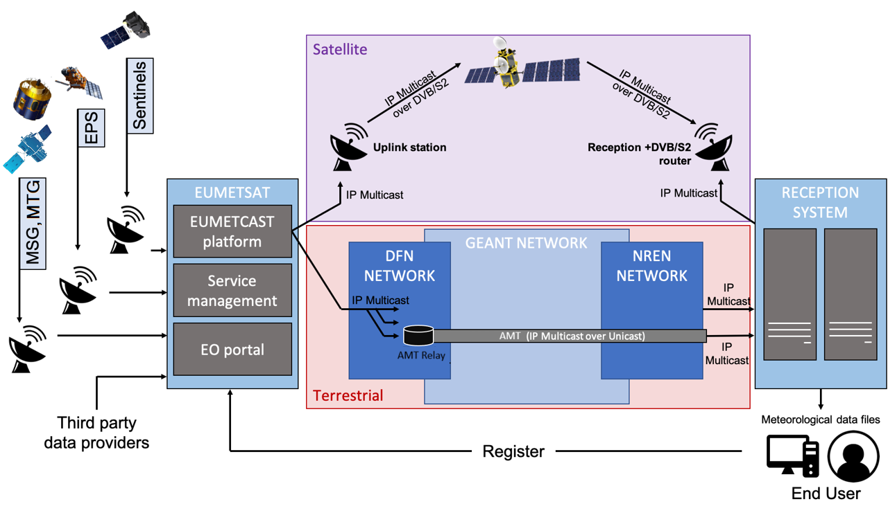

# EUMETCast Terrestrial AMT Flavour

This Ansible Playbook configures an existing virtual machine running
within the [European Weather Cloud (EWC)](https://europeanweather.cloud/), to equip it with the [EUMETCast Terrestrial](https://user.eumetsat.int/data-access/eumetcast-terrestrial) over [AMT software stack](https://gitlab.eumetsat.int/open-source/amt). 


EUMETCast is EUMETSAT’s primary dissemination mechanism for the near-real-time delivery of satellite data. EUMETCast serves data through two complementary delivery systems: EUMETCast Satellite and EUMETCast Terrestrial.



Terrestrial services for data distribution, available and supported, include:

>✅ Additional terrestrial services for data distribution will be created in the future for various missions.
If unsure of which services your credentials grant you access to, please contact the EUMETSAT User Helpdesk ([ops@eumetsat.int](mailto:ops@eumetsat.int)).


| | | | |
| --- | --- | --- | --- |
| Terrestrial Service | **Total Bandwidth (Mbps)** | Data | Default |
| **ter-1** | 240 | **EPS, MSG, Sentinel-3A/B, Sentinel-5P, Third Party data, MTG** | yes |
| **ter-2** | 168 | **Sentinel-6 data** | |
| **ter-3** | 230 | **Sentinel-5P L1B, Sentinel-3A/B OLCI L1 FR, Sentinel-3A/B SLSTR L1B, FY3 HIRAS, FY4 GIIRS, GOSAT, MTG HRFI-FD (4 high-res full-disk bands)** | |

## Functionality

* Installs and configures the EUMETCast Terrestrial client over Automatic Multicast Tunnelling (AMT)
* Deploys the Tellicast terrestrial receiver runtime
* Configures network translation required for multicast reception over AMT
* Creates maintenance jobs for log and data retention
* Automatically cleans up disk space by keeping only the latest 5 minutes of transmited data, under the `/home/eumetuser/data` subdirectory.

## Prerequisites
> ⛔ If deploying to an instance on the ECMWF site, using certian port numbers are blocked, even when a valid security group is attached to the instance. This is due to the outer perimeter firewall of the ECMWF site. For details see [EWC Security guidelines - Restrictive firewall (allow-listing)](https://confluence.ecmwf.int/display/EWCLOUDKB/EWC+Security+guidelines#EWCSecurityguidelines-Restrictivefirewall(allow-listing)).


> ⚠️ Only Ubuntu version 22 supported due
to constrains imposed by [dependencies](#dependencies).

> 💡 A VM plan with at least 64GB of RAM and 1TB+ of storage is recommended for successful setup and
stable operation.

* Register a user account on the [EUMETSAT User Portal](https://eoportal.eumetsat.int/)
* Subscribe to the service and data for EUMETCast Terrestrial
  * Ensure you select at least one EKU (temporal quota allocation)
* Request a EUMETCast Terrestrial user key for access from the EWC:
  * Write to EUMETSAT Helpdesk ([ops@eumetsat.int](mailto:ops@eumetsat.int)), making sure to provide them your EUMETSAT User Portal username alongside your request
* Install [git](https://git-scm.com/downloads) (version 2.0 or higher )
* Install [python](https://www.python.org/downloads) (version 3.9 or higher) 
* Install [ansible](https://pypi.org/project/ansible) (version 2.15 or higher)
* If you plan to configure an existing VM:
  * Verfiy your VM has the [prerequired security groups](https://confluence.ecmwf.int/display/EWCLOUDKB/EUMETCast+Terrestrial+on+AMT#EUMETCastTerrestrialonAMT-SecurityGroups) attached
  * Then skip to the [Usage](#usage) section below
* If you have not yet provisioned a VM, it is required to do so. You may choose one of the following approaches:
  * **A) Provision a new VM via UI:**
    * Create an SSH keypair (see [Creating the keys](https://confluence.ecmwf.int/display/EWCLOUDKB/Add+your+SSH+key+pair+to+Morpheus#AddyourSSHkeypairtoMorpheus-Creatingthekeys) section of the EWC documentation)
    * Import the SSH public key into Morpheus (see [Adding the keys in Morpheus](https://confluence.ecmwf.int/display/EWCLOUDKB/Add+your+SSH+key+pair+to+Morpheus#AddyourSSHkeypairtoMorpheus-AddingthekeysinMorpheus) section of the EWC documentation)
    * Provision a new VM through the web portal (see [Provision a new Instance - Web](https://confluence.ecmwf.int/display/EWCLOUDKB/Provision+a+new+instance+-+web) section of the EWC) documentation

    OR 
  * **B) Provision a new VM via CLI:**
    * Create an SSH keypair (see [Creating the keys](https://confluence.ecmwf.int/display/EWCLOUDKB/Add+your+SSH+key+pair+to+Morpheus#AddyourSSHkeypairtoMorpheus-Creatingthekeys) section of the EWC documentation)
    * Add you SSH public key to OpenStack (see [Import SSH Key](https://confluence.ecmwf.int/display/EWCLOUDKB/EWC+-+OpenStack+Command-Line+client#EWCOpenStackCommandLineclient-ImportSSHkey) section of the EWC documentation).
    * Provision a new VM via the OpenStack CLI (see [How to create a VM using the OpenStack CLI](https://confluence.ecmwf.int/display/EWCLOUDKB/EWC+-+How+to+create+a+VM+using+the+Openstack+CLI) section of the EWC documentation)
  
    OR
  * **C) Deploy this template, together with a new VM, via the [EWCCLI](https://pypi.org/project/ewccli/)**
 

## Usage

### 1. Clone the repository

```bash
git clone https://github.com/ewcloud/ewc-ansible-playbook-flavours-and-provisioning.git
```

#### 1.1. Change to the specific Item's subdirectory

```bash
cd playbooks/eumetcast-terrestrial-amt-flavour
```

#### 1.2. (Optional) Checkout an specific Item's version
>⚠️ Make sure to replace `x.y.z` in the command below, with your version of preference.

```bash
git checkout x.y.z
```


### 2. Download Ansible dependencies
>💡 By default, Ansible Roles are installed under the `~/.ansible/roles` directory within your working environment.

Download the correct version of the Ansible dependencies, if you haven't done so already:

```
ansible-galaxy role install -r requirements.yml
```

### 3. Specify the target host and SSH credentials
Create an inventory file to specify address/credentials that Ansible should use
to reach the virtual machine you wish to configure:

```yaml
# inventory.yml
---
ewcloud:
  hosts:
    eumetcast_amt:
      ansible_python_interpreter: /usr/bin/python3
      ansible_host: <add the IPV4 address of the target host>
      ansible_ssh_private_key_file: <add the path to local SSH private key file>
      ansible_user: ubuntu
      ansible_ssh_common_args: -o StrictHostKeyChecking=accept-new
```

### 4. Configure and apply the template

#### 4.1. Interactive Mode

By running the following command, you can trigger an interactive session that
prompts you for the necessary user inputs, and then applies changes to your
target EWC environment:

```bash
ansible-playbook \
  -i inventory.yml \
  -e '{
      "tellicast_license_user_name":"<redacted>",
      "tellicast_license_user_key":"<redacted>"
    }' \
  eumetcast-terrestrial-amt-flavour.yml
```

#### 4.2. Non-Interactive Mode

>💡 To learn more about defining variables at runtime, checkout the
[official Ansible documentation](https://docs.ansible.com/ansible/latest/playbook_guide/playbooks_variables.html).

You can also run in non-interactive mode by passing the
`--extra-vars` or `-e` flag, followed by a map of  key-value pairs; one for
each and every available input (see [inputs section](#inputs) below). For
example:

```bash
ansible-playbook -i inventory.yml eumetcast-terrestrial-amt-flavour.yml
```

## Inputs

| Name | Description | Type | Default | Required |
|------|-------------|------|---------|----------|
| tellicast_license_user_name | Tellicast license user identifier, equivalent to your EUMETSAT User Portal username. | `string` | n/a | yes |
| tellicast_license_user_key | Tellicast license activation key (i.e. the user key you obtained via from EUMETSAT Helpdesk). | `string` | n/a | yes |

## Dependencies

| Name  | Home URL |
|-------|-------|
| ewc-ansible-role-eumetcast-terrestrial-amt | https://github.com/ewcloud/ewc-ansible-role-eumetcast-terrestrial-amt |

## Operation

Checkout the [how-to guides](./docs/how-to/) to learn about management of the Item after initial setup.