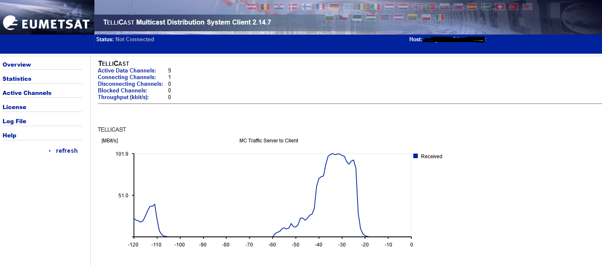

# How to monitor and check connectivity of the EUMETCast client

The Tellicast client provides a built-in web GUI for monitoring.

Open your browser and go to:

`http://<VM-public-or-internal-IP>:8500`

The left-hand tabs allow you to view:
- **Overview** — overall connectivity status
- **Statistics** — file availability
- **Active Channels** — currently subscribed channels
- **Log File** — real-time or buffered logs
- **License** — licence information
- **Help** — additional documentation

> ⚠️ Ensure the new port is allowed in your OpenStack security group. See the [EWC Knowledge Base](https://confluence.ecmwf.int/x/9hXEJg) page on security groups for details.

**Resources**
- [How to check file availability](./how-to-check-file-availability.md)
- [How to enable real-time logging](./how-to-enable-real-time-logging.md)

