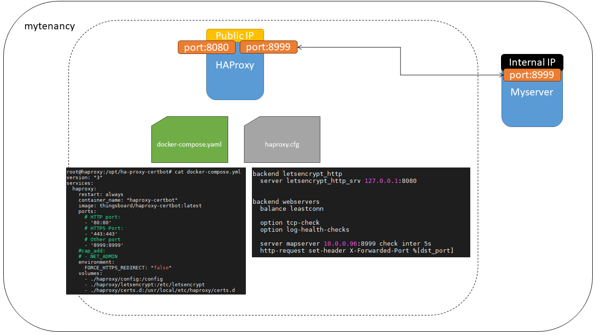

# Add a New SSL Certificate to a Server in HAProxy

This guide explains how to configure HAProxy to support SSL certificates and request a new certificate using Certbot for the European Weather Cloud. Follow these steps to ensure secure HTTPS traffic for your server.

## Configure HAProxy

To request SSL certificates from Let's Encrypt, configure a dedicated backend for the Let's Encrypt ACME challenge, exposed on port 8080. This backend handles the validation process for certificate issuance. Below is an example HAProxy configuration. Replace placeholders (e.g., `YOUR_DOMAIN`, `YOUR_SERVER_IP`) with your actual server details.

```
# HAProxy Config
global
  ulimit-n 500000
  maxconn 99999
  maxpipes 99999
  tune.maxaccept 500
 
  log 127.0.0.1 local0
  log 127.0.0.1 local1 notice
 
  ca-base /etc/ssl/certs
  crt-base /etc/ssl/private
 
  ssl-default-bind-ciphers ECDH+AESGCM:DH+AESGCM:ECDH+AES256:DH+AES256:ECDH+AES128:DH+AES:ECDH+3DES:DH+3DES:RSA+AESGCM:RSA+AES:RSA+3DES:!aNULL:!MD5:!DSS
  ssl-default-bind-options no-sslv3
 
defaults
  mode http
 
  timeout client 10s
  timeout connect 5s
  timeout server 10s
  timeout http-request 10s
 
frontend http-in
  bind *:80
  option forwardfor
 
  http-request add-header "X-Forwarded-Proto" "http"
 
  acl letsencrypt_http_acl path_beg /.well-known/acme-challenge/
 
  redirect scheme https if !letsencrypt_http_acl { env(FORCE_HTTPS_REDIRECT) -m str true }
 
  use_backend letsencrypt_http if letsencrypt_http_acl
  default_backend webservers
 
 
frontend https_in
  bind *:443 ssl crt /usr/local/etc/haproxy/default.pem crt /usr/local/etc/haproxy/certs.d ciphers ECDHE-RSA-AES256-SHA:RC4-SHA:RC4:HIGH:!MD5:!aNULL:!EDH:!AESGCM
 
  option forwardfor
 
  http-request add-header "X-Forwarded-Proto" "https"
 
  default_backend webservers
 
backend letsencrypt_http
  server letsencrypt_http_srv 127.0.0.1:8080
 
backend webservers
  balance leastconn
 
  option tcp-check
  option log-health-checks
  server mapserver 10.0.0.96:8999 check inter 5s
  http-request set-header X-Forwarded-Port %[dst_port]
```

### Configuration Notes
- **Global Section**: Configures system limits, logging, and SSL cipher suites for secure connections. The `ssl-default-bind-ciphers` ensures modern, secure ciphers are used, excluding weak protocols like MD5.
- **Defaults Section**: Sets HTTP mode and reasonable timeouts for client, server, and connection handling.
- **Frontend `http-in`**: Listens on port 80 for HTTP traffic, redirects to HTTPS unless handling Let's Encrypt ACME challenges, and forwards traffic to the appropriate backend.
- **Frontend `https-in`**: Listens on port 443 for HTTPS traffic, using SSL certificates stored in `/usr/local/etc/haproxy/certs.d`.
- **Backend `letsencrypt_http`**: Handles Let's Encrypt ACME challenges on port 8080.
- **Backend `webservers`**: Routes traffic to your application servers (e.g., `10.0.0.96:8999`), with health checks to ensure only healthy servers receive traffic.

> ⚠️ Ensure your Docker Compose file exposes port 8080 for the Let's Encrypt backend and that your VM's firewall allows traffic on ports 80, 443, and 8080. Refer to [How to modify HAProxy config file](https://confluence.ecmwf.int/display/EWCLOUDKB/How+to+modify+HAproxy+config+file) for guidance on modifying and validating the configuration.



## Add a New SSL Certificate

To add a new SSL certificate using Certbot, follow these steps. The certificate will be compatible with the HAProxy configuration above. After generating the certificate, run the refresh script to update HAProxy.

1. Request a certificate from Let's Encrypt:

   ```bash
   docker exec haproxy-certbot certbot certonly --webroot --webroot-path /var/www/html --domain YOUR_DOMAIN --email YOUR_EMAIL --dry-run
   ```

   - Replace `YOUR_DOMAIN` with your domain (e.g., `example.com`).
   - Replace `YOUR_EMAIL` with your email address for renewal notifications.
   - The `--dry-run` flag tests the setup without issuing a real certificate.

2. After verifying the setup, remove the `--dry-run` flag to request a live certificate:

   ```bash
   docker exec haproxy-certbot certbot certonly --webroot --webroot-path /var/www/html --domain YOUR_DOMAIN --email YOUR_EMAIL
   ```

3. Update HAProxy with the new certificate and restart the service:

   ```bash
   docker exec haproxy-certbot haproxy-refresh
   ```

   This command formats the certificate for HAProxy and restarts the service to apply the changes. No further action is required.

### Notes
- The certificate is stored in `/usr/local/etc/haproxy/certs.d` and automatically loaded by HAProxy (as specified in the `frontend https-in` section).
- Ensure the domain is correctly pointed to your server's public IP address.
- If you encounter issues, check the Certbot logs or validate the HAProxy configuration using:

   ```bash
   docker exec -it <CONTAINER_ID> haproxy -c -f /config/haproxy.cfg
   ```

   (Replace `<CONTAINER_ID>` with the actual ID, found using `docker ps`.)

## Resources
- [ThingsBoard HAProxy-Certbot Documentation](https://github.com/thingsboard/docker/blob/master/haproxy-certbot/README.md)
- [HAProxy SSL Configuration Guide](https://www.haproxy.com/documentation/haproxy/configuration/ssl/)
- [How to modify HAProxy config file](./how-to-modify-haproxy-config-file.md)