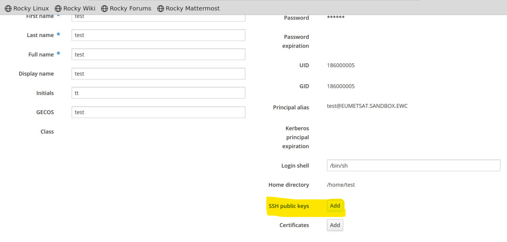

# How to administrate IPA users' public SSH keys
> 💡 To learn more about SSH keys, their creation and usage, checkout the ["SSH and SSH Key" page of the European Weather Cloud Knowledge Base](https://confluence.ecmwf.int/x/D7ATJg).

This guide describes basic administration requied to enable IPA user login via SSH keys. For advanced topics, refer to the [FreeIPA Official Documentation](https://www.freeipa.org/page/Documentation).

## Using CLI

First connect to IPA server with your shell using the IPA administrator username and password.
Then, procced to configure the authorized SSH keys for a give user with a command like:
```bash
ipa user-mod <USERNAME> --sshpubkey="ssh-rsa <key_content>"
```

### Examples

For adding a single SSH public key, belonging to the user `alice`, run:
```bash
ipa user-mod alice --sshpubkey="$(cat /home/alice/.ssh/id_rsa.pub)" 
```

To upload multiple keys, belonging to the the user `bob`, pass a comma-separated list of keys with a single `--sshpubkey` option:
```bash
ipa user-mod bob --sshpubkey="key1==,key2==,key3=="
```

## Using Web UI
>⚠️ This sections assumes your tenancy hosts a working [remote desktop server](../../../remote-desktop-flavour/).

1. Start by connecting to your Remote Desktop server with the IPA administrator username and password. 
2. Launch Firefox and point it to the IP address of the IPA server. 
3. Once on the IPA Server UI, click on the user and insert SSH keys:



## Resources

- [How to configure the IPA server](../how-to/how-to-configure-the-ipa-server.md)
- [FreeIPA Official Documentation](https://www.freeipa.org/page/Documentation)
