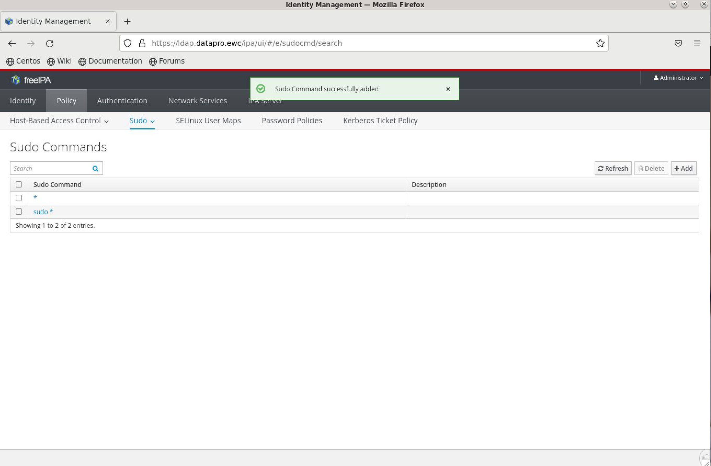
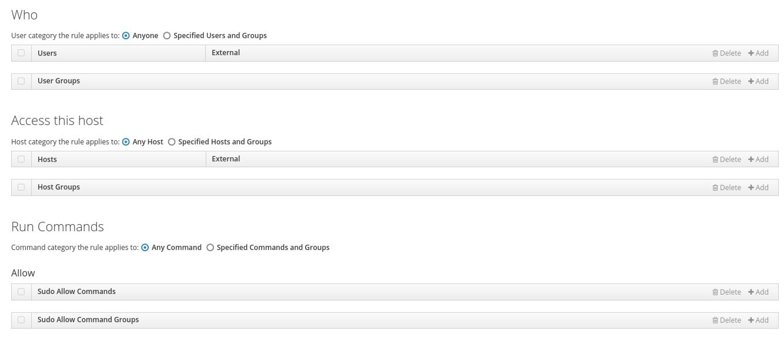

# How to Configure the IPA Server (LDAP and DNS)

This guide ensures basic yet secure management of your IPA server. For advanced topics, refer to the [FreeIPA Official Documentation](https://www.freeipa.org/page/Documentation).

## Introduction

> 💡 Some configuration changes may take time to synchronize across all machines. If changes do not take effect immediately, wait 5 to 15 minutes before attempting further modifications.

This guide covers essential tasks for managing IPA (LDAP and DNS) and DNS using the Identity Management (IPA) server on the European Weather Cloud (EWC). It includes instructions for both the command-line interface (CLI) and the web browser interface.

### Important: EWC-managed vs. Self-Service Deployment
The IPA server configuration differs based on how it was deployed:
- **EWC-managed Deployment (prior to September 2025)**: Supported only in tenancies created prior to September 2025. The IPA server is ewc-managed, with secrets crated and shared with tenancy admins over Morpheus Cypher upon onboarding.
- **Self-Service Deployment**: With the release of the [EWC Community Hub](https://europeanweather.cloud/community-hub?page=0), admins can now deploy the IPA server in a self-service manner. Secrets are generated during deployment and stored/updated in Morpheus Cypher.

If you deployed the IPA server via the EWC Community Hub, use the self-service secret names. For ewc-managed setups, use the old secret names. This guide notes differences where applicable.

## Getting Started

1. **Retrieve Admin Credentials from Morpheus Cypher**:

   

   - For **ewc-managed deployments**:
     - Admin Username: `secret/ipaadmin_username`
     - Password: `password/ipaadmin`
     - Domain Name: `secret/ldap_domain`
     - IPA Server Fully Qualified Domain Name: `secret/ldap_hostname`
     
   - For **self-service deployments**: 
     - Admin Username: `secret/ipa_admin_username`
     - Password: `secret/ipa_admin_password`
     - Domain Name: `secret/ipa_domain`
     - IPA Server Hostname: `secret/ipa_server_hostname`


## Configure the IPA Sever Using Command Line Interface
>⚠️ This sections assumes your tenancy hosts a working [SSH bastion server](../../../ssh-bastion-flavour/). 

1. **SSH into the IPA (LDAP and DNS) Instance**:
   Use the bastion host for secure access:

   ```bash
   ssh -J <Admin Username>@<SSH Bastion IP> <Admin Username>@<IPA Server IP>
   ```

   Replace `<SSH Bastion IP>` with the public IP of your SSH bastion and `<IPA Server IP>` with the private IP of your IPA server.

2. **Authenticate with Kerberos** (if needed for advanced commands):
   Once connected, obtain a Kerberos ticket:

   ```bash
   kinit <Admin Username>
   ```

   Enter the IPA admin password when prompted.

### Users and Groups

#### Check User Info

```bash
ipa user-show <LDAP Username>
```

#### List Existing Groups

```bash
ipa group-find
```

#### Show Group Information

```bash
ipa group-show <LDAP Group Name>
```

#### Verify Groups for a User

```bash
ipa group-find --user=<LDAP Username>
```

#### Add a User to a Group

```bash
ipa group-add-member <LDAP Group Name> --users=<LDAP Username>
```

#### Reset Password for a User

```bash
ipa passwd <LDAP Username>
```

(You will be prompted to enter and confirm the new password interactively.)

#### Add SSH Keys for a User

```bash
ipa user-mod <LDAP Username> --sshpubkey="ssh-rsa AAAAB3NzaC1yc2EAAAADAQABAAABAQD...=user@example.com"
```

Or load from a file:

```bash
ipa user-mod <LDAP Username> --sshpubkey="$(cat /path/to/id_rsa.pub)"
```

For multiple keys, use a comma-separated list:

```bash
ipa user-mod <LDAP Username> --sshpubkey="key1==,key2==,key3=="
```

#### List Active Users

```bash
ipa user-find --all
```

Or with formatted last login timestamps:

```bash
ipa user-find --all --raw | grep -iE '(dn:|krbLastSuccessfulAuth)' | cut -d ',' -f1 | cut -d: -f2 | sed -re 's/([0-9]{4})([0-9]{2})([0-9]{2})([0-9]{2})([0-9]{2})([0-9]+)Z/\3-\2-\1 \4:\5:\6/'
```


#### Add a New User

```bash
ipa user-add <LDAP Username> --first=<First Name> --last=<Last Name> --password
```

#### Change Password Expiration

```bash
ipa user-mod <LDAP Username> --password-expiration='2050-10-25T19:18:30Z'
```

#### Delete a User

```bash
ipa user-del <LDAP Username>
```

### DNS Management

#### List DNS Servers

```bash
ipa dnsserver-find
```

#### Add a DNS Forwarder

Add a single forwarder (e.g., Google's DNS at 8.8.8.8):

```bash
ipa dnsserver-mod --forwarder=8.8.8.8
```

For multiple forwarders with a policy:

```bash
ipa dnsserver-mod --forwarder=208.67.222.222 --forwarder=208.67.220.220 --forward-policy=first <DNS Server Name>
```

(Forward policies: `only`, `first`, or `none`. Replace `<DNS Server Name>` with your server, e.g., `ipa02.example.com`.)

### Hosts and DNS Zones

#### List Registered Hosts

```bash
ipa host-find
```

#### Show Host Details

```bash
ipa host-show <Hostname>
```

#### Remove a Host

```bash
ipa host-del <Hostname>
```

#### List DNS Zones

```bash
ipa dnszone-find
```

#### List DNS Records in a Zone

```bash
ipa dnsrecord-find <Zone Name>
```

#### Remove All DNS Records for a Resource

```bash
ipa dnsrecord-del <Zone Name> <Record Name> --del-all
```

### Advanced Configurations

#### Add a Sudo Rule to a Group

1. **Verify Group Exists**:

   ```bash
   ipa group-find <LDAP Group Name>
   ```

2. **List Existing Sudo Rules**:

   ```bash
   ipa sudorule-find
   ```

3. **Create a Sudo Rule** (e.g., for full access; customize as needed):

   ```bash
   ipa sudorule-add <Sudo Rule Name> --hostcat=all --runasusercat=all --runasgroupcat=all --cmdcat=all
   ```

4. **Assign Sudo Rule to a Group**:

   ```bash
   ipa sudorule-add-user <Sudo Rule Name> --groups=<LDAP Group Name>
   ```

5. **Add User to the Group**:

   ```bash
   ipa group-add-member <LDAP Group Name> --users=<LDAP Username>
   ```

6. **Verify Group Membership**:

   ```bash
   ipa group-show <LDAP Group Name>
   ```

7. **Verify Sudo Rule**:

   ```bash
   ipa sudorule-show <Sudo Rule Name>
   ```

## Configure the IPA Server Using the Web UI
>⚠️ This sections assumes your tenancy hosts a working [remote desktop server](../../../remote-desktop-flavour/). 

1. **Access the Web UI**:

   

   - Connect to a remote desktop instance in your EWC tenancy (e.g., via X2Go).
   - Open a terminal and launch Firefox (or another browser):

     ```bash
     firefox http://<IPA Server Fully Qualified Domain Name>
     ```
     OR

     ```bash
     firefox http://<IPA Server Hostname>.<Domain Name>
     ```
     Replace `<IPA Server Fully Qualified Domain Name>` or `<IPA Server Hostname>` and `<Domain Name>` according to your deployment type.

   

2. **Log In**:
   Use the retrieved admin credentials to log in.

### Common Tasks via Web UI

1. **Create Sudo Commands**:
   Navigate to **Policy > Sudo > Sudo Commands** and add commands as needed.

   

2. **Create a Sudo Rule** (e.g., `allow_all`):
   Go to **Policy > Sudo > Sudo Rules** and create a new rule. Configure it to allow all hosts, run-as users/groups, and commands.

   

   Inspect and adjust settings:

   
   

3. **Update Global Password Policy**:
   Navigate to **Policy > Password Policies > global_policy** and adjust expiration settings.

   

   After changes, reset the admin password to comply with the new policy.

4. **Set Default User Shell**:
   Go to **Policy > User Settings** and set the default shell to `/bin/bash`.

   


## Resources

- [FreeIPA Official Documentation](https://www.freeipa.org/page/Documentation)
