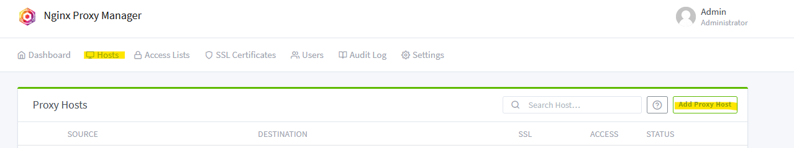
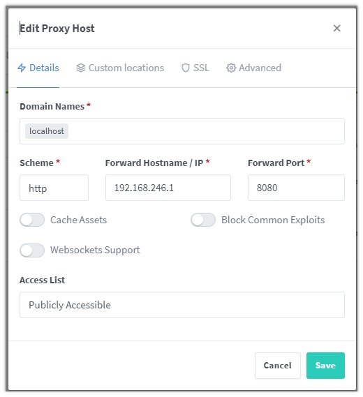
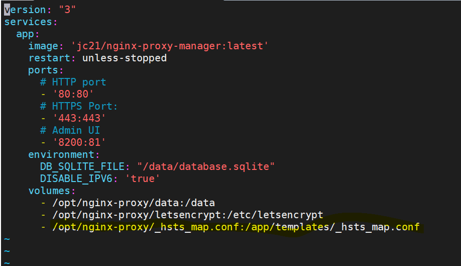
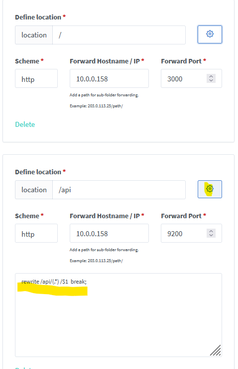

# How to add a new proxy host for specific domain
## Create a new host

1. From the admin UI of the NGINX Proxy Manager, go to the tab "Hosts" -> "Proxy hosts", and click 'Add Proxy host':



2. Fill the information required for the new host in Details tab:

    * Domain name
    * Scheme (e.g. HTTP, HTTPS)
    * Forward hostname/IP
    * Forward port
    * Cache assets (enabled) → When the browser downloads an asset, it follows a policy dictated by the server to figure out whether or not it should download that asset again on future visits  
    * Block common exploits (enabled) → Block SQL injections, file injections, spam, user agents, common bandwidth hoggers and hacking tools  
    * Websockets support (enabled) → provide full-duplex communications over a single TCP connection by using a stream of messages rather than a stream of bytes. This makes it easier to connect to data sources asynchronously in cloud deployments.  

 

  

3. For the SSL section, you need to have SSL certificates setup already to be selected from the list and you need to enable also:
    * Force SSL → helps you redirect insecure HTTP traffic to secure HTTPS and fix SSL errors without touching any code  
    * HSTS Enabled → protect visitors by ensuring that their browsers always connect to a website over HTTPS  
    * HTTP/2 Support → It can make websites faster, more secure, and use fewer network resources.  
    * HSTS Subdomains

  

## Known bugs

### Create custom locations for your endpoint

If you want to create custom locations for your endpoint, there is currently a bug that can be fixed with a workaround ([https://github.com/NginxProxyManager/nginx-proxy-manager/issues/3474#issuecomment-1902790528](https://github.com/NginxProxyManager/nginx-proxy-manager/issues/3474#issuecomment-1902790528)):

  

1. SSH into your NGINX proxy machine.
2. Obtain super user permission:
```bash
sudo su
```
3. Go to NGINX folder:
```bash
cd /opt/nginx-proxy/
```
4. Create an empty file called `_hsts_map.conf`:
```bash
touch _hsts_map.conf
```
5. Update the docker-compose file with the new line (see the one in yellow in the screenshot below `/opt/nginx-proxy/_hsts_map.conf:/app/templates/_hsts_map.conf`):
```bash
vi docker-compose.yml
```

    
6. Restart the container:
```bash
docker compose up -d
```
7. Now login to your NGINX Proxy Manager UI and modify the hosts according to your needs as in the below example. Note that you need to add a custom section into the configuration also to work properly: `rewrite /api/(.*) /$1 break;` (e.g. `/api` or others depending on your need). For example:

