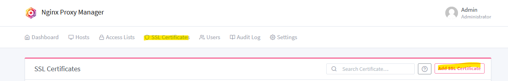

# How to add a new SSL Certificate for domain/s
>💡 SSL certificate is responsibility of the tenant.
You can add new SSL certificate for your domain from the admin UI of the NGINX Proxy Manager.

1. Go to tab "SSL certificates" -> Clicking `Add SSL Certificate`

>💡 Key files protected with a passphrase are not supported.

2. Enter all data and save a new access list that can be assigned to a Host.