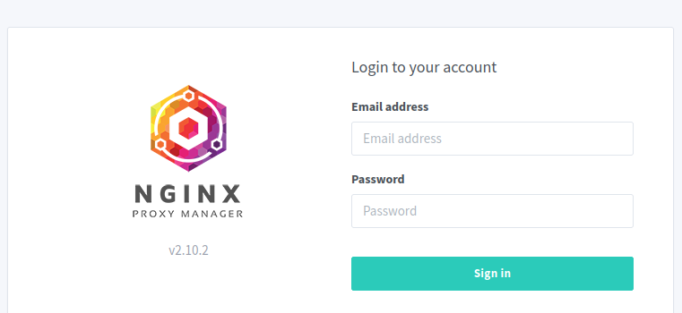

# How to configure the NGINX Proxy manager initial setup

Once the VM is provisioned, you need to configure NGINX Proxy manager initially, by accessing the admin UI.
  

# Access NGINX Proxy Admin UI

The NGINX Proxy Manager is usually accessible on the private internal network. You can easily gain access via graphical interface admin UI if you have a [remote desktop](../../../remote-desktop-flavor/) server already set up in the tenancy, connect to it and open a web browser (e.g. firefox). From there, you should be able to reach the NGINX Proxy UI from the browser, via navigating to **http://\<VM IP address\>:\<IP Port Number\>**.
  

## Initial Setup

When the NGINX Proxy Manager first starts, log in with the following username and password:

*   Default Proxy Manager username: **admin@example.com**
*   Default Proxy Manager password: **changeme**

The default NGINX Proxy manager username and password can only be used once. When you log in, you will be asked to update and change your credentials.

Now you are ready to create proxy host, [How to add a new proxy host for specific domain](../how-to/how-to-add-a-new-proxy-host-for-specific-domain.md) to learn more.