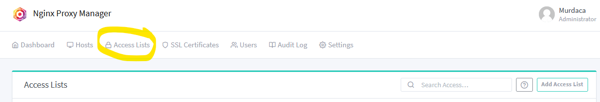

# How to create/modify an access list
Access list contains the IPs allowed to connect to a certain URL.

1. login into NGINX Proxy with your domain URL
2. Got to Access List and hit Add Access List button

3. Enter all data and save a new access list that can be assigned to a Host.